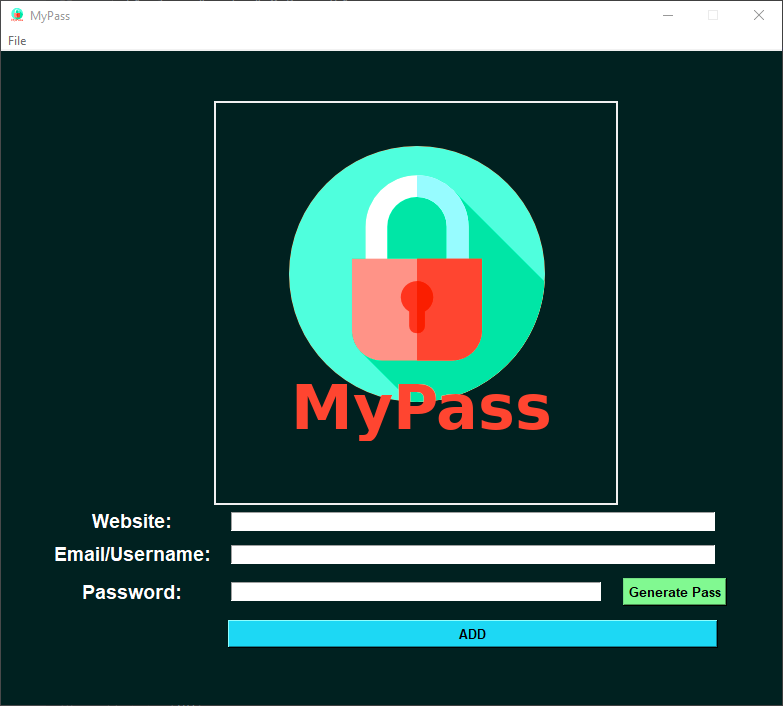

<div id="top"></div>
<!--
*** Thanks for checking out the Best-README-Template. If you have a suggestion
*** that would make this better, please fork the repo and create a pull request
*** or simply open an issue with the tag "enhancement".
*** Don't forget to give the project a star!
*** Thanks again! Now go create something AMAZING! :D
-->


<!-- PROJECT SHIELDS -->
<!--
*** I'm using markdown "reference style" links for readability.
*** Reference links are enclosed in brackets [ ] instead of parentheses ( ).
*** See the bottom of this document for the declaration of the reference variables
*** for contributors-url, forks-url, etc. This is an optional, concise syntax you may use.
*** https://www.markdownguide.org/basic-syntax/#reference-style-links
-->
[![Contributors][contributors-shield]][contributors-url]
[![Issues][issues-shield]][issues-url]
![Filesize][filesize-shield]
[![MIT License][license-shield]][license-url]


<!-- PROJECT LOGO -->
<br />
<div align="center">
  <a href="https://github.com/CrystlBearer/MyPass">
    
  </a>
    <p align="center">
    Logo was taken and modified from here: <a href="https://www.flaticon.com/free-icons/lock" title="lock icons">Lock icons created by Freepik - Flaticon</a>
    </p>
<h1 align="center">MyPass</h1>
  <p align="center">
    Password Manager that's offline and left only on the user's machine. It is saved into an encrypted file and can only be accessed during use of the application.
    <br />
    <a href="https://github.com/CrystlBearer/MyPass"><strong>Explore the docs »</strong></a>
    <br />
    <br />
    <a href="https://github.com/CrystlBearer/MyPass">View Demo</a>
    ·
    <a href="https://github.com/CrystlBearer/MyPass/issues">Report Bug</a>
    ·
    <a href="https://github.com/CrystlBearer/MyPass/issues">Request Feature</a>
  </p>
</div>


<!-- TABLE OF CONTENTS -->
<details>
  <summary>Table of Contents</summary>
  <ol>
    <li>
      <a href="#about-the-project">About The Project</a>
      <ul>
        <li><a href="#built-with">Built With</a></li>
      </ul>
    </li>
    <li>
      <a href="#getting-started">Getting Started</a>
      <ul>
        <li><a href="#prerequisites">Prerequisites</a></li>
        <li><a href="#installation">Installation</a></li>
      </ul>
    </li>
    <li><a href="#usage">Usage</a></li>
    <li><a href="#roadmap">Roadmap</a></li>
    <li><a href="#contributing">Contributing</a></li>
    <li><a href="#license">License</a></li>
    <li><a href="#contact">Contact</a></li>
  </ol>
</details>


<!-- ABOUT THE PROJECT -->
## About The Project
[![Product Name Screen Shot][product-screenshot]](https://github.com/CrystlBearer/MyPass)
This project is an offline password manager that uses Python Tkinter and the cryptography library.
This doesn't rely on the internet and stores on the local user's machine in their home directory.
The user's credentials are stored into an encrypted file that can only be accessed during the use of the application.

<p align="right">(<a href="#top">back to top</a>)</p>


### Built With

* [Python 3.9](https://www.python.org/downloads/)
* [Cryptography](https://github.com/pyca/cryptography/)

<p align="right">(<a href="#top">back to top</a>)</p>


<!-- GETTING STARTED -->
## Getting Started

To get a local copy up and running follow these simple example steps.

### Prerequisites
Install [Python 3.9](https://www.python.org/downloads/) which should include pip.

* pip
  ```sh
  pip install cryptography
  pip install openpyxl
  ```

### Installation

1. Clone the repo
   ```sh
   git clone https://github.com/CrystlBearer/MyPass.git
   ```


<p align="right">(<a href="#top">back to top</a>)</p>


<!-- USAGE EXAMPLES -->
## Usage
All the files are stored in ~/.mypass. 
When running the application for the first time, the application will ask the user to set their master password.


Afterwards, the main window application will appear to allow the user to add their user credentials. When the user exits, the application will encrypt the user's credential files so no one else can access them. The next time the user uses the application the user will have to enter their master password to access their list of credentials.

<p align="right">(<a href="#top">back to top</a>)</p>


<!-- ROADMAP -->
## Roadmap
See the [open issues](https://github.com/CrystlBearer/MyPass/issues) for a full list of proposed features (and known issues).

<p align="right">(<a href="#top">back to top</a>)</p>


<!-- CONTRIBUTING -->
## Contributing

Contributions are what make the open source community such an amazing place to learn, inspire, and create. Any contributions you make are **greatly appreciated**.

If you have a suggestion that would make this better, please fork the repo and create a pull request. You can also simply open an issue with the tag "enhancement".
Don't forget to give the project a star! Thanks again!

1. Fork the Project
2. Create your Feature Branch (`git checkout -b feature/AmazingFeature`)
3. Commit your Changes (`git commit -m 'Add some AmazingFeature'`)
4. Push to the Branch (`git push origin feature/AmazingFeature`)
5. Open a Pull Request

<p align="right">(<a href="#top">back to top</a>)</p>


<!-- LICENSE -->
## License

Distributed under the MIT License. See `LICENSE.txt` for more information.

<p align="right">(<a href="#top">back to top</a>)</p>


<!-- CONTACT -->
## Contact

Vivian Hoang

Project Link: [https://github.com/CrystlBearer/MyPass](https://github.com/CrystlBearer/MyPass)

<p align="right">(<a href="#top">back to top</a>)</p>


<!-- MARKDOWN LINKS & IMAGES -->
<!-- https://www.markdownguide.org/basic-syntax/#reference-style-links -->
[contributors-shield]: https://img.shields.io/github/contributors/CrystlBearer/MyPass?style=for-the-badge
[contributors-url]: https://github.com/CrystlBearer/MyPass/graphs/contributors
[issues-shield]: https://img.shields.io/github/issues/CrystlBearer/MyPass?style=for-the-badge
[issues-url]: https://github.com/CrystlBearer/MyPass/issues
[filesize-shield]: https://img.shields.io/github/repo-size/CrystlBearer/MyPass?style=for-the-badge
[license-shield]: https://img.shields.io/github/license/CrystlBearer/MyPass?style=for-the-badge
[license-url]: https://github.com/CrystlBearer/MyPass/LICENSE.txt
[product-screenshot]: images/MyPass_Main_Win.png
